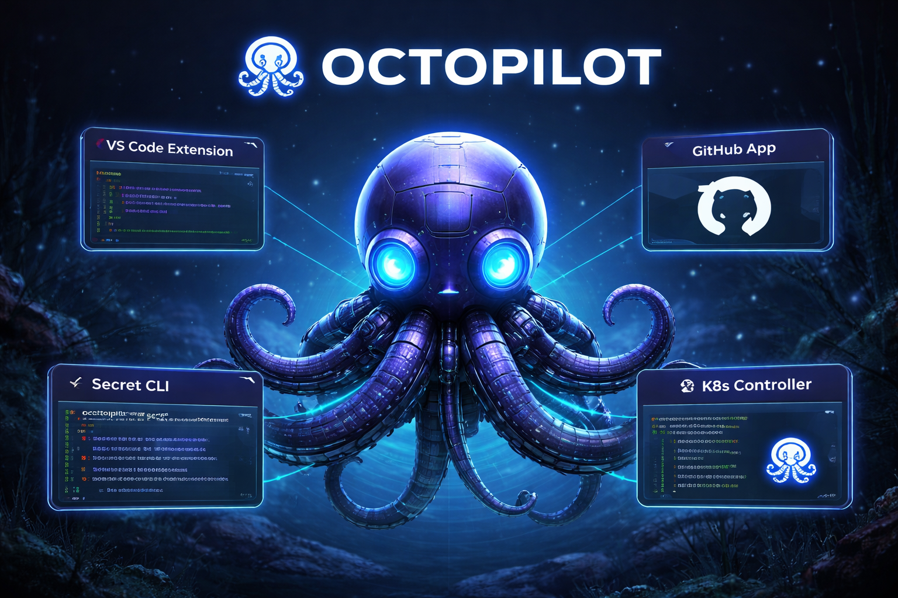

---

## What is OctoPilot?

> [!NOTE]
> **OctoPilot** is a carefully designed set of solutions to accelerate your application development. We remove the burden of configuring and managing build, test, and release pipelines so you can focus on shipping.

---

## Get started

| What you need | Where to go |
|---------------|-------------|
| **Pipeline CLI** — build, push, local registry, watch deployments | [**octopilot-pipeline-tools**](https://github.com/octopilot/octopilot-pipeline-tools) → `op build-push`, `op start-registry`, `op run`, and more |
| **Local HTTPS registry** — push/pull at `localhost:5001` with TLS | [**registry-tls**](https://github.com/octopilot/registry-tls) → use with `op start-registry` or run the image |
| **Secrets bridge** — GitOps → cloud secret stores (GCP, AWS, Azure) | [**secret-manager-controller**](https://github.com/octopilot/secret-manager-controller) → sync SOPS-encrypted secrets for serverless migration |
| **Reference apps** — one repo per frontend+backend pairing | [**SAMPLES.md**](./SAMPLES.md) → all `sample-*` repos, API contract, build/run/deploy |

> [!TIP]
> New here? Install the **op** CLI from [octopilot-pipeline-tools](https://github.com/octopilot/octopilot-pipeline-tools), run **`op start-registry`** for a local registry, then **`op build-push`** from any sample repo.

---

## Secret Manager Controller — GitOps to serverless

**[secret-manager-controller](https://github.com/octopilot/secret-manager-controller)** is the bridge between GitOps and serverless secret management. It lets you keep a single source of truth in Git (SOPS-encrypted secrets) while syncing those secrets into cloud-native stores so both Kubernetes and serverless workloads can use them.

**Role in OctoPilot:** When you adopt OctoPilot’s pipeline and samples, you often need secrets in both K8s (for build/deploy) and in serverless (Cloud Run, Lambda, Azure Functions). Without a sync mechanism, you end up maintaining secrets in two places. Secret Manager Controller reads SOPS-encrypted secrets from your GitOps repo (FluxCD/ArgoCD), decrypts them inside the cluster, and pushes them to **GCP Secret Manager**, **AWS Secrets Manager**, or **Azure Key Vault**. That keeps your GitOps workflow intact and unblocks serverless migration and FinOps savings.

- **Docs:** [octopilot.github.io/secret-manager-controller](https://octopilot.github.io/secret-manager-controller)
- **Quick start:** Apply the CRD and deploy with kustomize; see the repo [README](https://github.com/octopilot/secret-manager-controller#quick-start).

---

## Reference samples

We provide **one repository per frontend–backend pairing** (e.g. React+Go, Vue+Go, SolidJS+Go). Each sample has its own Skaffold setup and a simple greet API so you can adopt OctoPilot with minimal friction.

**→ Full list, setup, and contract:** [SAMPLES.md](./SAMPLES.md)
